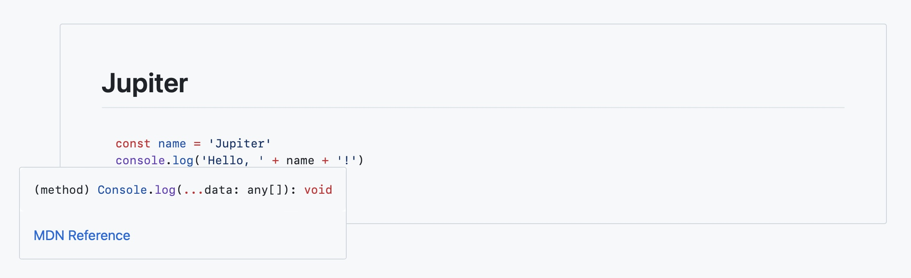

# rehype-twoslash

[![Build][badge-build-image]][badge-build-url]
[![Coverage][badge-coverage-image]][badge-coverage-url]
[![Downloads][badge-downloads-image]][badge-downloads-url]
[![Size][badge-size-image]][badge-size-url]
[![Sponsors][badge-sponsors-image]][badge-collective-url]
[![Backers][badge-backers-image]][badge-collective-url]
[![Chat][badge-chat-image]][badge-chat-url]

**[rehype][github-rehype]** plugin to process JavaScript and TypeScript code
with [`twoslash`][twoslash] and highlight it with
[`starry-night`][github-starry-night].

<!--
  To do: at some point, would be fun to have a `## Syntax` section that
  describes the syntax of `twoslash`.
-->

## Contents

* [What is this?](#what-is-this)
* [When should I use this?](#when-should-i-use-this)
* [Install](#install)
* [Use](#use)
* [API](#api)
  * [`Options`](#options)
  * [`Render`](#render)
  * [`RenderResult`](#renderresult)
  * [`Renderers`](#renderers)
  * [`rehypeTwoslash(options) (default)`](#rehypetwoslashoptions-default)
* [HTML](#html)
* [Markdown](#markdown)
* [CSS](#css)
* [JavaScript](#javascript)
* [Compatibility](#compatibility)
* [Security](#security)
* [Related](#related)
* [Contribute](#contribute)
* [License](#license)

## What is this?

This package is a [unified][github-unified] ([rehype][github-rehype]) plugin to
process JavaScript and TypeScript code with [`twoslash`][twoslash] and
highlight it with [`starry-night`][github-starry-night].

`twoslash` is a tool to run code through the TypeScript compiler and extract
info about that code.
Info you also see in your editor.
This info can for example be type errors or type info that is shown on hover.
`twoslash` also supports a command syntax through comments in the code,
so an author can highlight a particular piece of code,
ignore certain errors,
or show a specific file.

`starry-night` is a beautiful syntax highlighter,
like what GitHub uses to highlight code,
but free and in JavaScript.

## When should I use this?

This plugin is particularly useful for your own website or blog,
or any place where you want to talk about JavaScript-y code,
and want to improve the experience of your readers by showing them more
info about the code.

You can combine this package with
[`rehype-starry-night`][github-rehype-starry-night].
That applies syntax highlighting with `starry-night` to all code.

If you are not using remark or rehype,
you can instead use [`twoslash`][twoslash] directly.
If you don’t care for [`starry-night`][github-starry-night],
you can use [`@shikijs/twoslash`][github-shikijs-twoslash].

## Install

This package is [ESM only][github-gist-esm].
In Node.js (version 16+), install with [npm][npm-install]:

```sh
npm install rehype-twoslash
```

In Deno with [`esm.sh`][esmsh]:

```js
import rehypeTwoslash from 'https://esm.sh/rehype-twoslash@1'
```

In browsers with [`esm.sh`][esmsh]:

```html
<script type="module">
  import rehypeTwoslash from 'https://esm.sh/rehype-twoslash@1?bundle'
</script>
```

## Use

Say we have the following file `example.md`:

````markdown
# Jupiter

```js twoslash
const name = 'Jupiter'
console.log('Hello, ' + name + '!')
```
````

…and our module `example.js` contains:

```js
import rehypeStringify from 'rehype-stringify'
import rehypeTwoslash from 'rehype-twoslash'
import remarkParse from 'remark-parse'
import remarkRehype from 'remark-rehype'
import {read} from 'to-vfile'
import {unified} from 'unified'

const file = await read('example.md')

await unified()
  .use(remarkParse)
  .use(remarkRehype)
  .use(rehypeTwoslash)
  .use(rehypeStringify)
  .process(file)

console.log(String(file))
```

…then running `node example.js` yields:

```html
<h1>Jupiter</h1>
<div class="highlight highlight-js">
<pre><code class="language-js"><span class="pl-k">const</span> <span class="rehype-twoslash-popover-target" data-popover-target="rehype-twoslash-cnJcnJcn-0"><span class="pl-c1">name</span></span> <span class="pl-k">=</span> <span class="pl-s"><span class="pl-pds">'</span>Jupiter<span class="pl-pds">'</span></span>
<span class="rehype-twoslash-popover-target" data-popover-target="rehype-twoslash-cnJcnJcn-1"><span class="pl-en">console</span></span>.<span class="rehype-twoslash-popover-target" data-popover-target="rehype-twoslash-cnJcnJcn-2"><span class="pl-c1">log</span></span>(<span class="pl-s"><span class="pl-pds">'</span>Hello, <span class="pl-pds">'</span></span> <span class="pl-k">+</span> <span class="rehype-twoslash-popover-target" data-popover-target="rehype-twoslash-cnJcnJcn-3">name</span> <span class="pl-k">+</span> <span class="pl-s"><span class="pl-pds">'</span>!<span class="pl-pds">'</span></span>)
</code></pre>
<div class="rehype-twoslash-hover rehype-twoslash-popover" id="rehype-twoslash-cnJcnJcn-0" popover=""><pre class="rehype-twoslash-popover-code"><code class="language-ts"><span class="pl-k">const</span> <span class="pl-c1">name</span><span class="pl-k">:</span> <span class="pl-s"><span class="pl-pds">"</span>Jupiter<span class="pl-pds">"</span></span></code></pre></div>
<div class="rehype-twoslash-hover rehype-twoslash-popover" id="rehype-twoslash-cnJcnJcn-1" popover=""><pre class="rehype-twoslash-popover-code"><code class="language-ts"><span class="pl-k">var</span> <span class="pl-smi">console</span><span class="pl-k">:</span> <span class="pl-en">Console</span></code></pre></div>
<div class="rehype-twoslash-hover rehype-twoslash-popover" id="rehype-twoslash-cnJcnJcn-2" popover=""><pre class="rehype-twoslash-popover-code"><code class="language-ts">(<span class="pl-smi">method</span>) <span class="pl-c1">Console</span>.<span class="pl-en">log</span>(<span class="pl-k">...</span><span class="pl-smi">data</span>: <span class="pl-smi">any</span>[]): <span class="pl-k">void</span></code></pre><div class="rehype-twoslash-popover-description"><p><a href="https://developer.mozilla.org/docs/Web/API/console/log_static">MDN Reference</a></p></div></div>
<div class="rehype-twoslash-hover rehype-twoslash-popover" id="rehype-twoslash-cnJcnJcn-3" popover=""><pre class="rehype-twoslash-popover-code"><code class="language-ts"><span class="pl-k">const</span> <span class="pl-c1">name</span><span class="pl-k">:</span> <span class="pl-s"><span class="pl-pds">"</span>Jupiter<span class="pl-pds">"</span></span></code></pre></div>
</div>
```

With some [CSS][section-css] and [JavaScript][section-javascript] that could
look like this:

<picture>
  <source media="(prefers-color-scheme: dark)" srcset="screenshot-dark.jpg">
  
</picture>

## API

### `Options`

Configuration for `rehype-twoslash`.

###### Notes

`rehype-twoslash` runs on `<code>` elements with a `twoslash` directive.
That directive can be passed as a word in markdown (` ```ts twoslash `) or
as a class in HTML (`<code class="language-ts twoslash">`).

The inverse occurs when `directive` is `false`.
All `<code>` where the language class is JavaScript or TypeScript is
processed.
Then `no-twoslash` (` ```ts no-twoslash `,
`<code class="language-ts no-twoslash">`) can be used to prevent processing.

###### Fields

* `directive?` (`boolean | null | undefined`)
  — whether to require a `twoslash` directive (default: `true`)
* `grammars?` (`ReadonlyArray<Grammar> | null | undefined`)
  — grammars for `starry-night` to support (default:
  `[sourceJson, sourceJs, sourceTsx, sourceTs]`)
* `idPrefix?` (`string | null | undefined`)
  — prefix before IDs (default: `'rehype-twoslash-'`)
* `renderers?` (`Renderers | null | undefined`)
  — renderers for `twoslash` annotations (optional)
* `twoslash?` (`TwoslashOptions | null | undefined`)
  — options passed to `twoslash` (optional);
  this includes fields such as `cache`,
  `customTransformers`,
  and `filterNode`;
  see
  [`TwoslashOptions` from `twoslash`](https://github.com/twoslashes/twoslash/blob/1eb3af3/packages/twoslash/src/types/options.ts#L18)
  for more info

### `Render`

Render function.

Takes a particular annotation from the TypeScript compiler (such as an error)
and turns it into `hast` (HTML) content.
See `lib/render.js` for examples.

###### Notes

You can return `Array<ElementContent>` directly instead of a `RenderResult`
when you don’t have content for a footer.

###### Type

```ts
(
  state: State,
  annotation: Annotation,
  children: Array<ElementContent>
) => Array<ElementContent> | RenderResult
```

### `RenderResult`

Result from `Render`.

###### Fields

* `content?` (`Array<ElementContent> | undefined`)
  — main inline content to use in the code block;
  for example a `<span>` that causes a tooltip to show
* `footer?` (`Array<ElementContent> | undefined`)
  — extra content to use that relates to the code block;
  for example a `<div>` for a tooltip

### `Renderers`

Renderers.

Each key is a type of an annotation (such as `error` or `hover`) and each
value a corresponding render function.

###### Type

```ts
{ completion?: Render<NodeCompletion> | null | undefined; error?: Render<NodeError> | null | undefined; highlight?: Render<NodeHighlight> | null | undefined; hover?: Render<...> | ... 1 more ... | undefined; query?: Render<...> | ... 1 more ... | undefined; }
```

### `rehypeTwoslash(options) (default)`

Plugin to process JavaScript and TypeScript code with `twoslash`
and highlight it with `starry-night`.

###### Parameters

* `options?` (`Readonly<Options> | null | undefined`)
  — configuration (optional)

###### Returns

Transform (`(tree: Root, file: VFile) => Promise<Root>`).

## HTML

On the input side,
this plugin looks for code blocks with a `twoslash` class.
So:

```html
<pre><code class="language-ts twoslash">console.log('Hello, Mercury!')</code></pre>
```

It will warn when that class is used with a programming language that
`twoslash` does not understand (such as Rust).

If you want to process all JavaScript and TypeScript code blocks,
you can set `directive: false` in options.
Then the `language-*` class is enough and no directive is needed.
You can still prevent processing of a particular block with a `no-twoslash`
class:

```html
<pre><code class="language-ts no-twoslash">console.log('Hello, Mars!')</code></pre>
```

On the output side,
this plugin generates markup that can be enhanced with
[CSS][section-css] and [JavaScript][section-javascript] into tooltips and
more.
You can also choose to generate different HTML by passing custom render
functions in `options.renderers`.

To illustrate,
here is an example of a tooltip target for the identifier in a variable
declaration (`const name = …`):

```html
<span
  class="rehype-twoslash-popover-target"
  data-popover-target="rehype-twoslash-cnJcnJcn-3"
><span class="pl-c1">name</span></span>
```

It has a corresponding tooltip:

```html
<div
  class="rehype-twoslash-hover rehype-twoslash-popover"
  id="rehype-twoslash-cnJcnJcn-3"
  popover=""
>
  <pre class="rehype-twoslash-popover-code"><code class="language-ts"><span class="pl-k">const</span> <span class="pl-c1">name</span><span class="pl-k">:</span> <span class="pl-s"><span class="pl-pds">"</span>Jupiter<span class="pl-pds">"</span></span></code></pre>
</div>
```

Observe that there are sufficient classes to hook into with CSS and JavaScript
and that unique identifiers connect the popover and its popover target together.

## Markdown

When combined with [`remark-parse`][github-remark-parse] and
[`remark-rehype`][github-remark-rehype],
this plugin works similarly on markdown to how it does on HTML as described
above.
It then understands the `twoslash` and `no-twoslash` word in the info string,
right after the language.
To illustrate:

````markdown
```ts twoslash
console.log('Hello, Venus!')
```

```ts no-twoslash
console.log('Hello, Earth!')
```
````

## CSS

This plugin generates sufficient classes that can be styled with CSS.
Which ones to use and how to style them depends on the rest of your website
and your heart’s desire.
To illustrate,
see [`demo/index.css`][file-demo-css].
But get creative!

## JavaScript

This plugin generates markup that needs to be made interactive with JavaScript.
What to do exactly,
and how to do it,
depends on your website and your preferences.
For inspiration,
see [`demo/index.js`][file-demo-js].

## Compatibility

Projects maintained by the unified collective are compatible with maintained
versions of Node.js.

When we cut a new major release, we drop support for unmaintained versions of
Node.
This means we try to keep the current release line, `rehype-twoslash@1`,
compatible with Node.js 16.

## Security

Use of `rehype-twoslash` is likely not safe on arbitrary user content,
as it passes code through the TypeScript compiler,
which I assume has some access to the file system and there might be ways to
exploit it.

## Related

* [`rehype-starry-night`](https://github.com/rehypejs/rehype-starry-night)
  — apply syntax highlighting with `starry-night` to all code

## Contribute

See [`contributing.md`][health-contributing] in [`rehypejs/.github`][health]
for ways to get started.
See [`support.md`][health-support] for ways to get help.

This project has a [code of conduct][health-coc].
By interacting with this repository, organization, or community you agree to
abide by its terms.

## License

[MIT][file-license] © [Titus Wormer][wooorm]

<!-- Definitions -->

[badge-backers-image]: https://opencollective.com/unified/backers/badge.svg

[badge-build-image]: https://github.com/rehypejs/rehype-twoslash/actions/workflows/main.yml/badge.svg

[badge-build-url]: https://github.com/rehypejs/rehype-twoslash/actions

[badge-collective-url]: https://opencollective.com/unified

[badge-coverage-image]: https://img.shields.io/codecov/c/github/rehypejs/rehype-twoslash.svg

[badge-coverage-url]: https://codecov.io/github/rehypejs/rehype-twoslash

[badge-downloads-image]: https://img.shields.io/npm/dm/rehype-twoslash.svg

[badge-downloads-url]: https://www.npmjs.com/package/rehype-twoslash

[badge-size-image]: https://img.shields.io/bundlejs/size/rehype-twoslash

[badge-size-url]: https://bundlejs.com/?q=rehype-twoslash

[badge-sponsors-image]: https://opencollective.com/unified/sponsors/badge.svg

[badge-chat-image]: https://img.shields.io/badge/chat-discussions-success.svg

[badge-chat-url]: https://github.com/rehypejs/rehype/discussions

[esmsh]: https://esm.sh

[file-demo-css]: demo/index.css

[file-demo-js]: demo/index.js

[file-license]: license

[github-gist-esm]: https://gist.github.com/sindresorhus/a39789f98801d908bbc7ff3ecc99d99c

[github-rehype]: https://github.com/rehypejs/rehype

[github-rehype-starry-night]: https://github.com/rehypejs/rehype-starry-night

[github-remark-parse]: https://github.com/remarkjs/remark/tree/main/packages/remark-parse

[github-remark-rehype]: https://github.com/remarkjs/remark-rehype

[github-shikijs-twoslash]: https://github.com/shikijs/shiki/tree/main/packages/twoslash

[github-starry-night]: https://github.com/wooorm/starry-night

[github-unified]: https://github.com/unifiedjs/unified

[health-coc]: https://github.com/rehypejs/.github/blob/main/code-of-conduct.md

[health-contributing]: https://github.com/rehypejs/.github/blob/main/contributing.md

[health-support]: https://github.com/rehypejs/.github/blob/main/support.md

[health]: https://github.com/rehypejs/.github

[npm-install]: https://docs.npmjs.com/cli/install

[section-css]: #css

[section-javascript]: #javascript

[twoslash]: https://twoslash.netlify.app

[wooorm]: https://wooorm.com
